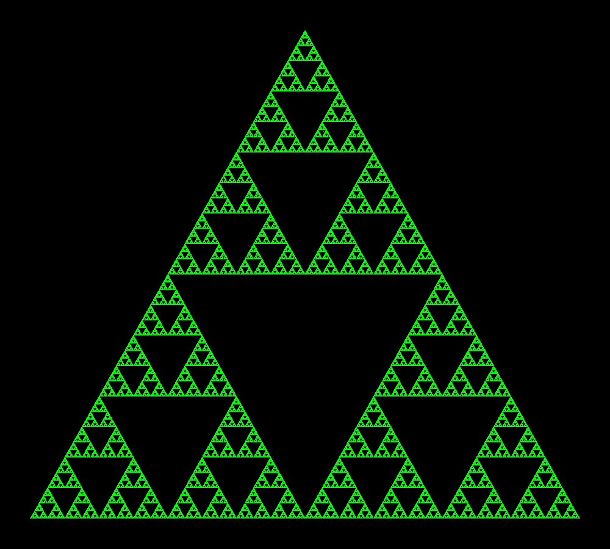

## Introduction

This project provides a program generating the ***Sierpinski triangle***, a _fractal_.
___

## The Sierpinski triangle

The way it is obtained is of particular interest: 
1. start by drawing 3 points, the vertices of 
a triangle 
2. draw a 4th point wherever you want (better on the inner surface of the triangle) 
3. randomly chose a vertex and draw a point exactly at half distance between the last point 
drawn and the vertex chosen 
4. repeat the operation as much time as you want and you'll always obtain the fractal image
___

## Project info

- **main.py**

This file contains the main program. 
You can choose the _starting point_ and the number of _total points_ drown by editing 
the attributes `start_pt` and `total_pt`. You can also select a different _color_ 
through the `color` attribute for a bunch of things: the colors available are listed 
in the module `colors.py`. **If the color provided doesn't exist or no color is provided,
every point will have a random color** from the ones of the module above mentioned.

- **colors.py**

This file contains a _dictionary_ and a _list_ with 9 of the main RGB colors.   
The structs can be extended by adding extra colors.
___

## Required Modules
The program requires `Pillow` and `random` modules to execute.
___

## Example 
```python
background_color = c.colors_dict['black']   # set the background color
start_pt = (560, 380)                       # set the position of the first point
start_pt_color = c.colors_dict['white']     # set its color
color = 'lime'                              # set the color for all others point
total_pt = 1000000                            # set the number of points to draw
```
The result should look like this:


